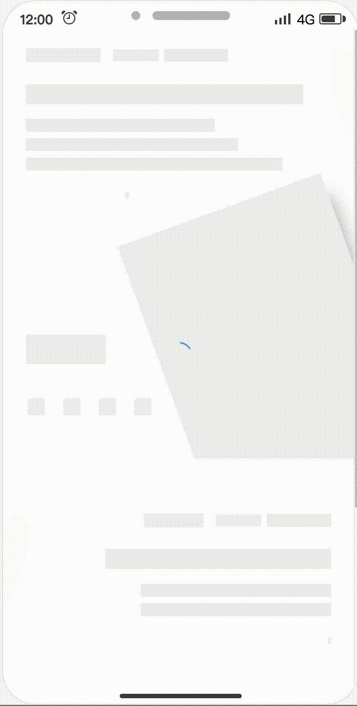
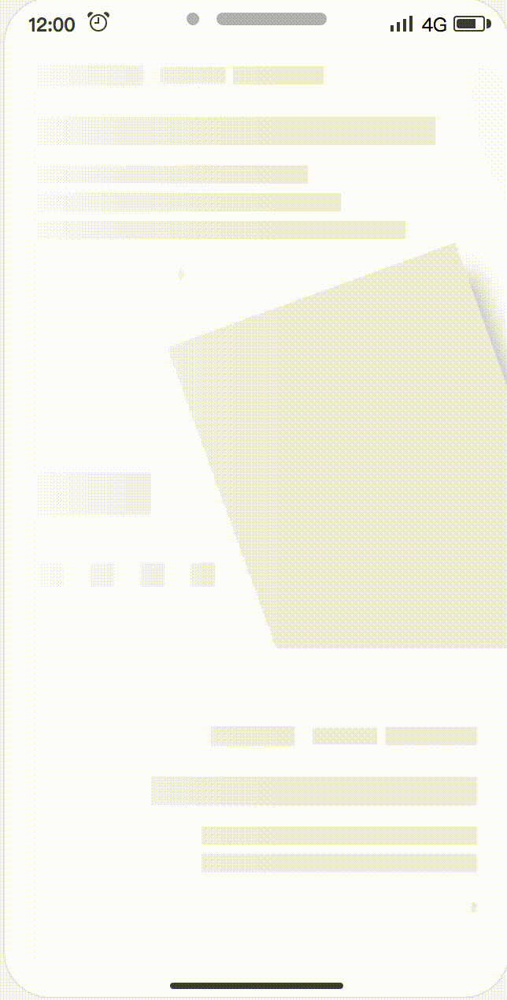
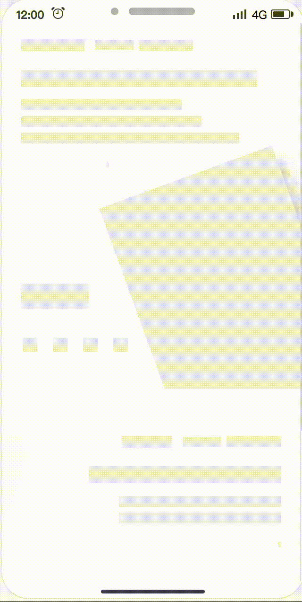
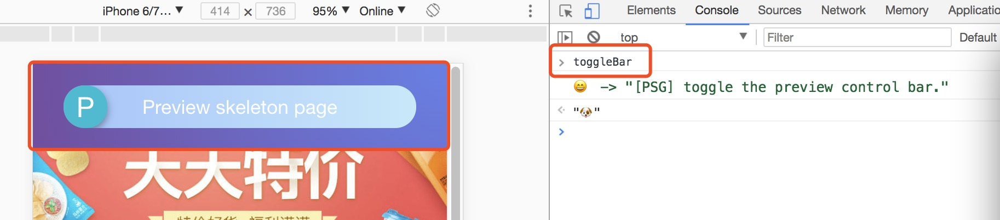
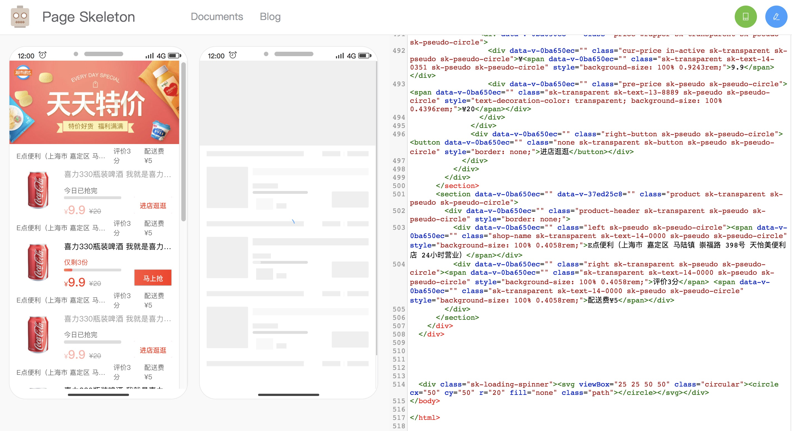

### copy ElemeFE page-skeleton-webpack-plugin

katoto-copy-skeleton-plugin clone ElemeFE 的版本，修改一下业务相关的东西

### 修改部分

- 修复一些已知插件问题，详见 [官方 Demo 踩坑](https://juejin.im/post/5ed4c22ae51d4578810b5459)
- 去除原 after-emit 的 outputSkeletonScreen， 改用自己的
- 优化预览二维码，实现实时修改样式，二维码实时更新
- 手机扫一扫预览，加入适配 flexible.js,保证看到的样式更真实
- 调整 priview 预览，把原 1280 宽度改成 375 手机宽度

### 待修改项

- 打包之后没有适配 js ，会看到初始样式，然后是适配后的样式。 这些需要修改公共 js
- 迁移到 web_leka
- 是否可生成 weex 形式
- 生成的骨架屏图片宽高有点不对

附上该插件的简易时序图


https://github.com/Jocs/jocs.github.io/issues/2

<hr />


### 更新npm 包
```
npm publish
```


<div align="center">

  <h3>
    <a href="https://zhuanlan.zhihu.com/p/34702561">
      Blog
    </a>
   <span> | </span>
    <a href="https://github.com/ElemeFE/page-skeleton-webpack-plugin/blob/master/docs/i18n/zh_cn.md">
      中文
    </a>
   <span> | </span>
    <a href="https://github.com/ElemeFE/page-skeleton-webpack-plugin#features">
      Features
    </a>
   <span> | </span>
​    <a href="https://github.com/ElemeFE/page-skeleton-webpack-plugin#examples">
      Examples
    </a>
​    <span> | </span>
    <a href="https://github.com/ElemeFE/page-skeleton-webpack-plugin#installation">
      Install
    </a>
    <span> | </span>
    <a href="https://github.com/ElemeFE/page-skeleton-webpack-plugin#basic-use">
      Basic Use
    </a>
    <span> | </span>
    <a href="https://github.com/ElemeFE/page-skeleton-webpack-plugin#documents">
      Documents
    </a>
    <span> | </span>
    <a href="https://github.com/ElemeFE/page-skeleton-webpack-plugin#contribution">
      Contribution
    </a>
  </h3>
</div>

<br />


### Features

Page Skeleton is a webpack plugin.The purpose of the plugin is to generate the corresponding skeleton screen page according to different route pages in your project, and to pack the skeleton screen page into the corresponding static route page through webpack.

- Support multiple loading animations
- Preview on mobile
- Support multiple routes
- Can be customized, and also directly modify the skeleton page source code in the preview page
- Almost zero configuration available

<h4 align="center">Loading animations</h4>

|         Spin         |         Shine         |         Chiaroscuro         |
| :------------------: | :-------------------: | :-------------------------: |
|  |  |  |

_speed up play_

### Examples

All examples are in the `examples` folder.

- [**sale**](https://github.com/ElemeFE/page-skeleton-webpack-plugin/tree/master/examples/sale)

### Installation

Use `npm` to install this plugin, and you also need to install [html-webpack-plugin](https://github.com/jantimon/html-webpack-plugin).

> npm install --save-dev page-skeleton-webpack-plugin
>
> npm install --save-dev html-webpack-plugin

### Basic Use

**Step 1：configration**

After installing the plug-in according to the above tutorial, you need to configure the plugin so that the plugin can run normally. The plugin will perform different operations depending on the environment of the node. When `NODE_ENV === 'development'`, the plug-in can perform operations for generating and writing skeleton pages.

```javascript
const HtmlWebpackPlugin = require("html-webpack-plugin");
const { SkeletonPlugin } = require("page-skeleton-webpack-plugin");
const path = require("path");
const webpackConfig = {
  entry: "index.js",
  output: {
    path: __dirname + "/dist",
    filename: "index.bundle.js"
  },
  plugin: [
    new HtmlWebpackPlugin({
      // Your HtmlWebpackPlugin config
    }),
    new SkeletonPlugin({
      pathname: path.resolve(__dirname, `${customPath}`), // the path to store shell file
      staticDir: path.resolve(__dirname, "./dist"), // the same as the `output.path`
      routes: ["/", "/search"] // Which routes you want to generate skeleton screen
    })
  ]
};
```

:notebook_with_decorative_cover:Since the plugin selects different operations based on the `process.env.NODE_ENV` environment variable, so you need to configurate environment variables in the `scrpt` option in the `package.json` file as follows:

```json
"scripts": {
  "dev": "cross-env NODE_ENV=development node server.js",
  "build": "rm -rf dist && cross-env NODE_ENV=production webpack --progress --hide-modules"
}
```

That is, setting `NODE_ENV` to `development` in the development environment and `NODE_ENV` to `production` in the production environment.

#### Step 2：Modify template `index.html` of html-webpack-plugin

Add comment `<!-- shell -->` in the root element of you application.

```html
<!DOCTYPE html>
<html lang="en">
  <head>
    <meta charset="UTF-8" />
    <title>Document</title>
  </head>
  <body>
    <div id="app">
      <!-- shell -->
    </div>
  </body>
</html>
```

#### Step 3：Operations and write shell

In the development page, use CtrlOrCmd + enter to call out the plugin interactive interface, or enter the `toggleBar` callout interface in the browser's JavaScript console.



Click the button in the interactive interface to preview the skeleton page. This process may take about 20s. After the plugin is ready for the skeleton page, it will automatically open the preview page through the browser, as shown below.



Scan the QR code in the preview page to preview the skeleton page on the mobile phone. You can directly edit the source code on the preview page. Write the skeleton page into the shell.html file by clicking the Write button in the upper right corner.

Re-package the application with webpack. When the page is restarted, you can see the application's skeleton structure before getting the data.

### Documents

**Default options**

```javascript
const pluginDefaultConfig = {
  port: "8989",
  text: {
    color: "#EEEEEE"
  },
  image: {
    shape: "rect", // `rect` | `circle`
    color: "#EFEFEF",
    shapeOpposite: []
  },
  button: {
    color: "#EFEFEF",
    excludes: []
  },
  svg: {
    color: "#EFEFEF",
    shape: "circle", // circle | rect
    shapeOpposite: []
  },
  pseudo: {
    color: "#EFEFEF", // or transparent
    shape: "circle" // circle | rect
  },
  device: "iPhone 6 Plus",
  debug: false,
  minify: {
    minifyCSS: { level: 2 },
    removeComments: true,
    removeAttributeQuotes: true,
    removeEmptyAttributes: false
  },
  defer: 5000,
  excludes: [],
  remove: [],
  hide: [],
  grayBlock: [],
  cookies: [],
  cssUnit: "rem",
  decimal: 4,
  logLevel: "info",
  quiet: false,
  noInfo: false,
  logTime: true
};
```

### License

[**MIT**](https://github.com/ElemeFE/page-skeleton-webpack-plugin/blob/master/LICENSE).

Copyright (c) 2017-present, @ElemeFE
